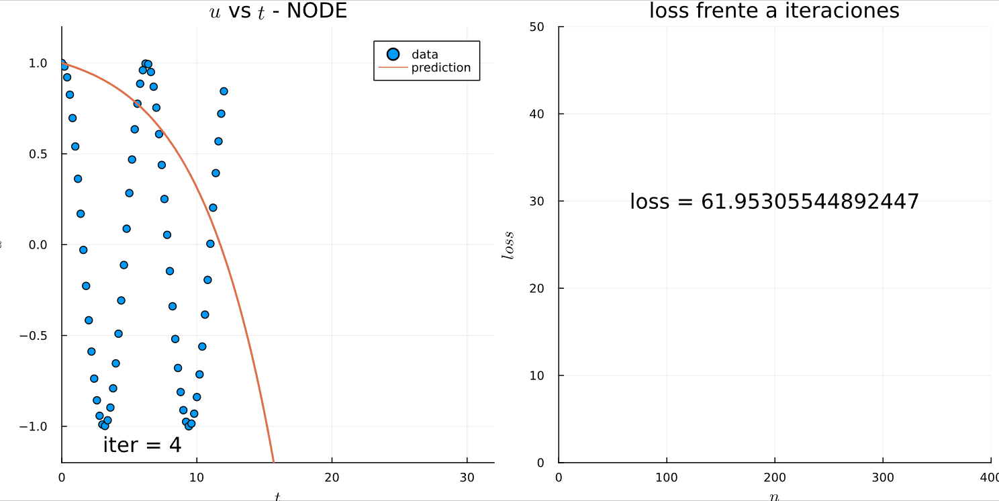
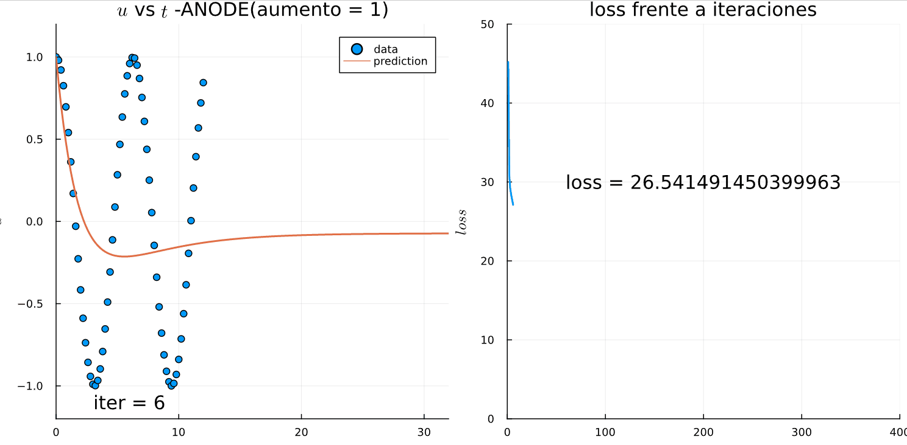

# TFM-Simulation-Intelligence
Repositorio del Trabajo de Fin de Máster de Julián María Galindo Álvarez. Master en Lógica, Computación e Inteligencia Artificial de la Universidad de Sevilla

## Ajuste de función 2D

Ajuste de la función dada por la EDO:

$$
\begin{split}
    & \begin{cases}
        \dfrac{du}{dt} = 
        \dfrac{d}{dt}
        \begin{bmatrix}
            u_1(t)\\
            u_2(t)
        \end{bmatrix}=  
        \begin{bmatrix}
            -0.1u_1^3-2u_2^3\\
            2u_1^3-0.1u_2^3
        \end{bmatrix}
        = A^T \cdot 
        \begin{bmatrix}
            u_1^3\\
            u_2^3
        \end{bmatrix}\\
        \\
         u(0)=
        \begin{bmatrix}
            u_1(0)\\
            u_2(0)
        \end{bmatrix}=
        \begin{bmatrix}
             2\\
             0
        \end{bmatrix}
    \end{cases} \\
    \\
    & \text{donde } t \in [0,1] \text{ y } A =         
        \begin{bmatrix}
            -0.1 & -2\\
            2 & -0.1
        \end{bmatrix}.
\end{split}
$$

  

    

<em>Fig 1. Entrenamiento y extrapolación de 0.5 con una Neural ODE.</em>

  

    

<em>Fig 2. Entrenamiento y extrapolación de 0.5 con una Augmented Neural ODE con 1 dimensión de aumento.</em>

## Ajuste de la función coseno

    

<em>Fig 3. Una NODE no es capaz de aprender características de segundo orden.</em>

  

    

<em>Fig 4. ANODE puede ajustar dinámicas de segundo orden tratándola como un sistema de primer orden en dimensiones superiores (aumentadas).</em>

## MNIST

Se han probado también los modelos NODE y ANODE en el problema clásico de MNIST. En el directorio MNIST se encuentran dos archivos de julia distintos:
*  **mnist_anode5_original.jl**: Implementación del modelo ANODE original de los autores de <a id="2">[2]</a>. El código original ([repositorio](https://github.com/EmilienDupont/augmented-neural-odes)) en Pytorch ha sido adaptado a Julia. 
*  **mnist_node_downsample.jl** Modificación del modelo anterior añadiendo un downsampling previo a la capa NODE.

Los resultados de los entrenamientos pueden consultarse en los archivos .txt del directorio. Con el modelo original se ha obtenido un rendimiento en test de 89.8% mientras que en el modificado un 98.2%.

# Referencias

<a id="1">[1]</a> 
Chen, R. T., Rubanova, Y., Bettencourt, J., & Duvenaud, D. K. (2018). Neural ordinary differential equations. Advances in neural information processing systems, 31.

<a id="2">[2]</a> 
Dupont, E., Doucet, A., & Teh, Y. W. (2019). Augmented neural odes. Advances in Neural Information Processing Systems, 32.

<a id="3">[3]</a> 
Norcliffe, A., Bodnar, C., Day, B., Simidjievski, N., & Liò, P. (2020). On second order behaviour in augmented neural odes. Advances in Neural Information Processing Systems, 33, 5911-5921.

<a id="4">[4]</a> 
Lavin, A., Zenil, H., Paige, B., Krakauer, D., Gottschlich, J., Mattson, T., ... & Pfeffer, A. (2021). Simulation intelligence: Towards a new generation of scientific methods. arXiv preprint arXiv:2112.03235.
